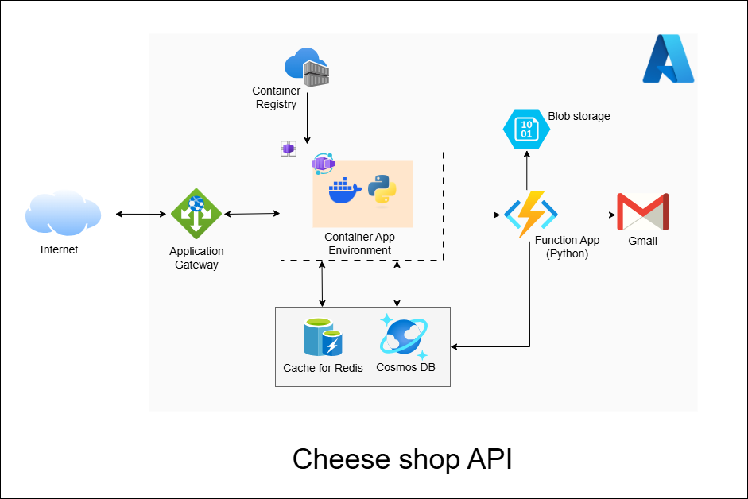

# 30 Days DevOps Challenge - NBA Data Lake
Day 3: Building a building a Sports Data Lake leveraging Azure blob storage, and Synapse Analytics




## Project Overview
This project demonstrates how to build a data pipeline for NBA sports analytics using Azure services. The pipeline fetches NBA player data from an API, stores it in Azure Blob Storage, and creates a queryable table in Azure Synapse Analytics. The data can then be queried and processed using any tool.

## Features
- Data Ingestion: Fetch NBA player data from the sportsdata.io API.
- Data Storage: Store raw JSON data in Azure Blob Storage.
- Schema Transformation: Transform JSON data to Parquet using Synapse pipeline
- Table Creation: Create a table in Azure Synapse Analytics with parquet schema.
- Data Querying: Query the table using SQL.

## Prerequisites
- Python 3.x
- Azure Account: An active Azure subscription.
- Azure Blob Storage: To store raw JSON data.
- Azure Synapse Analytics: To create and query tables.
- SportsData API key

## Dependencies
- azure-storage-blob
- azure-synapse-spark
- requests
- python-dotenv
- pyodbc

## Project Structure
```shell
03_NBADataLake/
├── azure_resources.py
├── data_operations.py
├── setup_data_lake.py
├── .gitignore
├── .env
├── requirements.txt
└── README.md
```

## Running the application
1. Clone the repository
    ```shell
    git clone git@github.com:Jekwulum/03_NBADataLake.git
    cd 03_NBADataLake
    ```
2. Create a virtual environment:
   ```shell
   python -m venv .venv
   source .venv/Scripts/activate  # On Windows use `.venv\Scripts\activate`
   ```
3. Install the dependencies:
   ```shell
   pip install -r requirements.txt
   ```
4. Configure environment variables (.env):
   ```shell
   # Azure configurations
   AZURE_SUBSCRIPTION_ID=your_subscription_id
   AZURE_RESOURCE_GROUP=your_resource_group_name
   AZURE_STORAGE_ACCOUNT=your_storage_account
   AZURE_CONNECTION_STRING=your_connection_string # will be dynamucally filled
   
   SQL_ADMIN_LOGIN=your_sql_admin_login
   SQL_ADMIN_PASSWORD=your_sql_admin_password
   SQL_DATABASE=nba_analytics
   SYNAPSE_WORKSPACE_NAME=your-workspace-name
   SYNAPSE_SQL_ENDPOINT=your_workspace_name.sql.azuresynapse.net # will be dynamucally filled

   # Sportsdata.io configurations
   SPORTS_DATA_API_KEY=your_api_key
   NBA_ENDPOINT=your_nba_endpoint
   ```
5. Run the application:
   ```shell 
   python setup_nba_data_lake.py
   ```

## What I learned
- Azure Blob storage container creation and management
- Environment variable management for secure API keys
- Python best practices for API integration
- Transforming JSON to Parquet
- Git workflow for project development
- Effective Error handling
- Cloud resource management

## Future Enhancements
- Add weather forecasting
- Implement data visualization
- Add more cities
- Create automated testing
- Set up CI/CD pipeline

## Workflow
1. Data Ingestion
   Fetch NBA player data from the sportsdata.io API. <br>
   The data is returned in JSON format.

2. Data Storage <br>
   Upload the JSON data to Azure Blob Storage.

3. Data Transformation <br>
   Transform the JSON data to Parquet format for efficient querying using Synapse pipeline.

4. Schema Inference <br>
   Create a table in Azure Synapse Analytics with an inferred schema.

5. Data Querying <br>
   Query the table using SQL.
